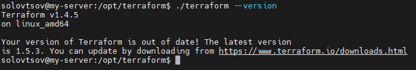

## Домашнее задание к занятию «Введение в Terraform»
Цель задания\
Установить и настроить Terrafrom.\
Научиться использовать готовый код.\
Чеклист готовности к домашнему заданию\
Скачайте и установите актуальную версию terraform >=1.4.X . Приложите скриншот вывода команды terraform --version.\

Скачайте на свой ПК данный git репозиторий. Исходный код для выполнения задания расположен в директории 01/src.\
Убедитесь, что в вашей ОС установлен docker.\

## Задание 1
1.Перейдите в каталог src. Скачайте все необходимые зависимости, использованные в проекте.\
2.Изучите файл .gitignore. В каком terraform файле согласно этому .gitignore допустимо сохранить личную, секретную информацию?\
## Ответ:
`personal.auto.tfvars`\
3.Выполните код проекта. Найдите в State-файле секретное содержимое созданного ресурса random_password, пришлите в качестве ответа конкретный ключ и его значение.
## Ответ:
`"result": "6Qr4DjlY55zKykU1",`\
4.Раскомментируйте блок кода, примерно расположенный на строчках 29-42 файла main.tf. Выполните команду terraform validate. Объясните в чем заключаются намеренно допущенные ошибки? Исправьте их.
## Ответ:
Исправленная часть конфига:
```
resource "docker_image" "nginx"{
  name         = "nginx:latest"
  keep_locally = true
}

resource "docker_container" "nginx"{
  image = docker_image.nginx.image_id
  name  = "example_${random_password.random_string.result}"

  ports {
    internal = 80
    external = 8000
  }
}
```
Ошибки заключались в остутствии лейбла имя, неправильного имени в лейбле и неправильное имя в ресурсе docker_container.\
5.Выполните код. В качестве ответа приложите вывод команды docker ps
## Ответ:
```
solovtsov@my-server:/opt/terraform/src$ docker ps
CONTAINER ID   IMAGE          COMMAND                  CREATED         STATUS         PORTS                  NAMES
171862f88695   021283c8eb95   "/docker-entrypoint.…"   3 seconds ago   Up 3 seconds   0.0.0.0:8000->80/tcp   example_ACrSFr3636Gw9yHl
```
6.Замените имя docker-контейнера в блоке кода на hello_world, выполните команду terraform apply -auto-approve. Объясните своими словами, в чем может быть опасность применения ключа -auto-approve ? В качестве ответа дополнительно приложите вывод команды docker ps
## Ответ:
```
solovtsov@my-server:/opt/terraform/src$ docker ps
CONTAINER ID   IMAGE          COMMAND                  CREATED          STATUS          PORTS                  NAMES
c9071a816304   021283c8eb95   "/docker-entrypoint.…"   46 seconds ago   Up 45 seconds   0.0.0.0:8000->80/tcp   hello_world
```
Отсутствует список изменений, тераформ не спрашивает подтверждения, можно не нароком залить некорректные изменения.\
7.Уничтожьте созданные ресурсы с помощью terraform. Убедитесь, что все ресурсы удалены. Приложите содержимое файла terraform.tfstate.
## Ответ:
```

{
  "version": 4,
  "terraform_version": "1.4.5",
  "serial": 11,
  "lineage": "cbaed85b-fa78-1470-ea99-1792355e2608",
  "outputs": {},
  "resources": [],
  "check_results": null
}
```
8.Объясните, почему при этом не был удален docker образ nginx:latest ? Ответ подкрепите выдержкой из документации провайдера.
## Ответ:
```
resource "docker_image" "nginx"{
  name         = "nginx:latest"
  keep_locally = true
}
```
keep_locally - (Optional, boolean) If true, then the Docker image won't be deleted on destroy operation.\
If this is false, it will delete the image from the docker local storage on destroy operation.\

Для удаление образа параметр keep_locally нужно перевсти в false
