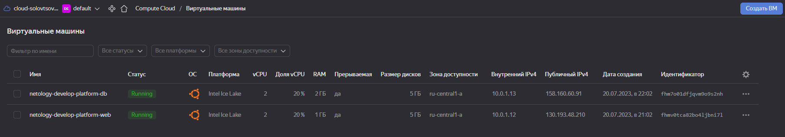

## Задание 1
 В качестве ответа всегда полностью прикладываете ваш terraform-код в git!

Изучите проект. В файле variables.tf объявлены переменные для yandex provider.
\Переименуйте файл personal.auto.tfvars_example в personal.auto.tfvars.
\Заполните переменные (идентификаторы облака, токен доступа). Благодаря .gitignore этот файл не попадет в публичный репозиторий.
\Вы можете выбрать иной способ безопасно передать секретные данные в terraform.
\Сгенерируйте или используйте свой текущий ssh ключ. Запишите его открытую часть в переменную vms_ssh_root_key.
\Инициализируйте проект, выполните код. Исправьте намеренное допущенные ошибки. Ответьте в чем заключается их суть?
#### Ответ:
Ошибки были допущены в конфигурации ВМ. У Yandex Cloud отсутствует тип платформы standart-4, правильно писать standard и указывать тип c 1 по 3,
\также у платформы standard-3? которая была выбрана мною, отсутствует возоможность выставить cores = 1, минимум 2 и core_fraction = 5, минимум 20.
\Ответьте, как в процессе обучения могут пригодиться параметры preemptible = true и core_fraction=5 в параметрах ВМ? Ответ в документации Yandex cloud.
#### Ответ:
premtible = true - позволяет сделать ВМ прерываемой, что существенно снижает ее стоимость, однако, раз в сутки ВМ отключается.
\core_fraction - влияет на производительность CPU, что также позволяет экономить денежные средства.

\В качестве решения приложите:

скриншот ЛК Yandex Cloud с созданной ВМ,

скриншот успешного подключения к консоли ВМ через ssh(к OS ubuntu необходимо подключаться под пользователем ubuntu: "ssh ubuntu@vm_ip_address"),
ответы на вопросы.


## Задание 2
Изучите файлы проекта.
\Замените все "хардкод" значения для ресурсов yandex_compute_image и yandex_compute_instance на отдельные переменные.
\К названиям переменных ВМ добавьте в начало префикс vm_web_ . Пример: vm_web_name.
\Объявите нужные переменные в файле variables.tf, обязательно указывайте тип переменной. Заполните их default прежними значениями из main.tf.
```
###yandex compute image vars

variable "vm_web_family" {
  type        = string
  default     = "ubuntu-2004-lts"
  description = "image family name"
}

###yandex compute instance vars

variable "vm_web_name" {
  type        = string
  default     = "netology-develop-platform-web"
  description = "VM name"
}

variable "vm_web_platform_id" {
  type        = string
  default     = "standard-v3"
  description = "Type of Yandex Cloud platform"
}

variable "vm_web_cores" {
  type        = string
  default     = "2"
  description = "Number of vCPU cores"
}

variable "vm_web_memory" {
  type        = string
  default     = "1"
  description = "VM RAM"
}

variable "vm_web_core_fraction" {
  type        = string
  default     = "20"
  description = "vCPU performance level"
}

```

Проверьте terraform plan (изменений быть не должно).

## Задание 3
Создайте в корне проекта файл 'vms_platform.tf' . Перенесите в него все переменные первой ВМ.
\Скопируйте блок ресурса и создайте с его помощью вторую ВМ(в файле main.tf): "netology-develop-platform-db" , cores = 2, memory = 2, core_fraction = 20.
\Объявите ее переменные с префиксом vm_db_ в том же файле('vms_platform.tf').
\Примените изменения.


## Задание 4
Объявите в файле outputs.tf output типа map, содержащий { instance_name = external_ip } для каждой из ВМ.
\Примените изменения.
\В качестве решения приложите вывод значений ip-адресов команды terraform output

## Задание 5
В файле locals.tf опишите в одном local-блоке имя каждой ВМ, используйте интерполяцию ${..} с несколькими переменными по примеру из лекции.
\Замените переменные с именами ВМ из файла variables.tf на созданные вами local переменные.
\Примените изменения.
```
locals {
   vm_web  = "${var.vm_web_name}-${var.vm_web_platform_id}"
   vm_db   = "${var.vm_db_name}-${var.vm_db_platform_id}"
}
```
```
solovtsov@my-server:/opt/terraform/src$ ./terraform plan
data.yandex_compute_image.ubuntu: Reading...
yandex_vpc_network.develop: Refreshing state... [id=enpemjlfghfb7nos7q3b]
data.yandex_compute_image.ubuntu: Read complete after 0s [id=fd85f37uh98ldl1omk30]
yandex_vpc_subnet.develop: Refreshing state... [id=e9b43cijb13l648leete]
yandex_compute_instance.db_platform: Refreshing state... [id=fhm7o01dfjqvm9o9s2nh]
yandex_compute_instance.platform: Refreshing state... [id=fhmv0tca82bo4ljbni7l]

Terraform used the selected providers to generate the following execution plan. Resource actions are indicated with the following symbols:
  ~ update in-place

Terraform will perform the following actions:

  # yandex_compute_instance.db_platform will be updated in-place
  ~ resource "yandex_compute_instance" "db_platform" {
        id                        = "fhm7o01dfjqvm9o9s2nh"
      ~ name                      = **"netology-develop-platform-db" -> "netology-develop-platform-db-standard-v3"**
        # (9 unchanged attributes hidden)

        # (6 unchanged blocks hidden)
    }

  # yandex_compute_instance.platform will be updated in-place
  ~ resource "yandex_compute_instance" "platform" {
        id                        = "fhmv0tca82bo4ljbni7l"
      ~ name                      = **"netology-develop-platform-web" -> "netology-develop-platform-web-standard-v3"**
        # (9 unchanged attributes hidden)

        # (6 unchanged blocks hidden)
    }

Plan: 0 to add, 2 to change, 0 to destroy.
```
##Задание 6
Вместо использования 3-х переменных ".._cores",".._memory",".._core_fraction" в блоке resources {...}, объедените их в переменные типа map с именами "vm_web_resources" и "vm_db_resources".
\В качестве продвинутой практики попробуйте создать одну map переменную vms_resources и уже внутри нее конфиги обеих ВМ(вложенный map).
```
###yandex compute instance vars

variable "vm_web_name" {
  type        = string
  default     = "netology-develop-platform-web"
  description = "VM name"
}

variable "vm_web_platform_id" {
  type        = string
  default     = "standard-v3"
  description = "Type of Yandex Cloud platform"
}

variable "vm_web_resources" {
  type        = map
  default     = { cores = 2, memory = 1, core_fraction = 20 }
  description = "VM resources"
}

###yandex compute instance vars

variable "vm_db_name" {
  type        = string
  default     = "netology-develop-platform-db"
  description = "VM name"
}

variable "vm_db_platform_id" {
  type        = string
  default     = "standard-v3"
  description = "Type of Yandex Cloud platform"
}

variable "vm_db_resources" {
  type        = map
  default     = { cores = 2, memory = 2, core_fraction = 20 }
  description = "VM resources"
}
```
Так же поступите с блоком metadata {serial-port-enable, ssh-keys}, эта переменная должна быть общая для всех ваших ВМ.
Найдите и удалите все более не используемые переменные проекта.
```
###ssh vars

variable "vms_metadata" {
  type        = map
  default     = { serial-port = 1, ssh = "ubuntu:/home/solovtsov/.ssh/id_rsa.pub" }
  description = "VMs metadata"
}

###yandex compute image vars

variable "vm_web_family" {
  type        = string
  default     = "ubuntu-2004-lts"
  description = "image family name"
}

###yandex compute instance vars

variable "vm_web_name" {
  type        = string
  default     = "netology-develop-platform-web"
  description = "VM name"
}

variable "vm_web_platform_id" {
  type        = string
  default     = "standard-v3"
  description = "Type of Yandex Cloud platform"
}

variable "vm_web_resources" {
  type        = map
  default     = { cores = 2, memory = 1, core_fraction = 20 }
  description = "VM resources"
}

###yandex compute instance vars

variable "vm_db_name" {
  type        = string
  default     = "netology-develop-platform-db"
  description = "VM name"
}

variable "vm_db_platform_id" {
  type        = string
  default     = "standard-v3"
  description = "Type of Yandex Cloud platform"
}

variable "vm_db_resources" {
  type        = map
  default     = { cores = 2, memory = 2, core_fraction = 20 }
  description = "VM resources"
}
```
Проверьте terraform plan (изменений быть не должно).

