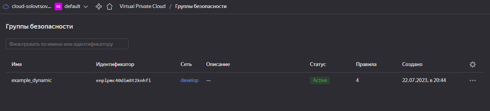
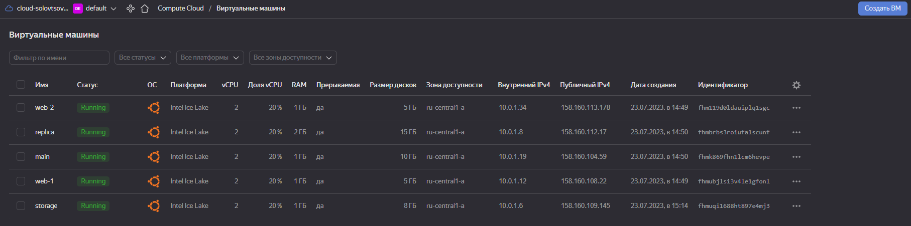

# Домашнее задание к занятию "Управляющие конструкции в коде Terraform"

### Цель задания

1. Отработать основные принципы и методы работы с управляющими конструкциями Terraform
2. Освоить работу с шаблонизатором Terraform(Interpolation Syntax)

------

### Чеклист готовности к домашнему заданию

1. Зарегистрирован аккаунт в Yandex Cloud. Использован промокод на грант.
2. Установлен инструмент yandex cli.
3. Доступен исходный код для выполнения задания в директории [**03/src**](https://github.com/netology-code/ter-homeworks/tree/main/03/src).
4. Любые ВМ, использованные при выполнении задания должны быть прерываемыми, для экономии средств.

------

### Инструменты/ дополнительные материалы, которые пригодятся для выполнения задания

1. [Консоль управления Yandex Cloud](https://console.cloud.yandex.ru/folders/<cloud_id>/vpc/security-groups).
2. [Группы безопасности](https://cloud.yandex.ru/docs/vpc/concepts/security-groups?from=int-console-help-center-or-nav).
3. [Datasource compute disk](https://terraform-eap.website.yandexcloud.net/docs/providers/yandex/d/datasource_compute_disk.html).


### Задание 1

1. Изучите проект.
2. Заполните файл personal.auto.tfvars
3. Инициализируйте проект, выполните код (он выполнится даже если доступа к preview нет).

Примечание: Если у вас не активирован preview доступ к функционалу "Группы безопасности" в Yandex Cloud - запросите доступ у поддержки облачного провайдера. Обычно его выдают в течении 24-х часов.

Приложите скриншот входящих правил "Группы безопасности" в ЛК Yandex Cloud  или скриншот отказа в предоставлении доступа к preview версии.



------

### Задание 2

1. Создайте файл count-vm.tf. Опишите в нем создание двух **одинаковых** ВМ  web-1 и web-2(не web-0 и web-1!), с минимальными параметрами, используя мета-аргумент **count loop**. Назначьте ВМ созданную в 1-м задании группу безопасности.

```
ata "yandex_compute_image" "ubuntu" {
  family = "ubuntu-2004-lts"
}

resource "yandex_compute_instance" "web" {
  name        = "web-${count.index + 1}"
  platform_id = "standard-v3"
  count       = 2
  resources {
    cores         = "2"
    memory        = "1"
    core_fraction = "20"
  }

  boot_disk {
    initialize_params {
      image_id = data.yandex_compute_image.ubuntu.image_id
    }
  }
  scheduling_policy {
    preemptible = true
  }
  network_interface {
    subnet_id = yandex_vpc_subnet.develop.id
    nat       = true
    security_group_ids = [ yandex_vpc_security_group.example.id ]
  }

  metadata = {
    serial-port-enable = "1"
    ssh-keys           = "ubuntu:${local.ssh_key}"
  }
}
```

2. Создайте файл for_each-vm.tf. Опишите в нем создание 2 ВМ с именами "main" и "replica" **разных** по cpu/ram/disk , используя мета-аргумент **for_each loop**. Используйте для обеих ВМ одну, общую переменную типа list(object({ vm_name=string, cpu=number, ram=number, disk=number  })). При желании внесите в переменную все возможные параметры.3. ВМ из пункта 2.2 должны создаваться после создания ВМ из пункта 2.1.

```
resource "yandex_compute_instance" "vm" {

  depends_on = [ yandex_compute_instance.web ]

  for_each = { for i in var.vm_resources : i.vm_name => i }

  name        = each.value.vm_name
  platform_id = "standard-v3"
  resources {
    cores         = each.value.cores
    memory        = each.value.memory
    core_fraction = each.value.core_fraction
  }

  boot_disk {
    initialize_params {
      image_id  = data.yandex_compute_image.ubuntu.image_id
      size      = each.value.disk
    }
  }
  scheduling_policy {
    preemptible = true
  }
  network_interface {
    subnet_id = yandex_vpc_subnet.develop.id
    nat       = true
  }

  metadata = {
    serial-port-enable = "1"
    ssh-keys           = "ubuntu:${local.ssh_key}"
  }
}
```

variables.tf:

```
###cloud vars
variable "token" {
  type        = string
  description = "OAuth-token; https://cloud.yandex.ru/docs/iam/concepts/authorization/oauth-token"
}

variable "cloud_id" {
  type        = string
  description = "https://cloud.yandex.ru/docs/resource-manager/operations/cloud/get-id"
}

variable "folder_id" {
  type        = string
  description = "https://cloud.yandex.ru/docs/resource-manager/operations/folder/get-id"
}

variable "default_zone" {
  type        = string
  default     = "ru-central1-a"
  description = "https://cloud.yandex.ru/docs/overview/concepts/geo-scope"
}
variable "default_cidr" {
  type        = list(string)
  default     = ["10.0.1.0/24"]
  description = "https://cloud.yandex.ru/docs/vpc/operations/subnet-create"
}

variable "vpc_name" {
  type        = string
  default     = "develop"
  description = "VPC network&subnet name"
}

variable "ssh_key" {
  type        = string
  description = "ssh-key"
}

variable "vm_resources" {
  type = list(object( {
    vm_name       = string
    cores         = number
    memory        = number
    core_fraction = number
    disk          = number
  }))
  default = [
    { vm_name = "main", cores = 2, memory = 1, core_fraction = 20, disk = 10 },
    { vm_name = "replica", cores = 2, memory = 2, core_fraction = 20, disk = 15 }
  ]
  description = "Set VM resources"
}
```

4. Используйте функцию file в local переменной для считывания ключа ~/.ssh/id_rsa.pub и его последующего использования в блоке metadata, взятому из ДЗ №2.

```
locals {
  ssh_key = file("/home/solovtsov/.ssh/id_rsa.pub")
}
```

5. Инициализируйте проект, выполните код.


------

### Задание 3

1. Создайте 3 одинаковых виртуальных диска, размером 1 Гб с помощью ресурса yandex_compute_disk и мета-аргумента count в файле **disk_vm.tf** .
2. Создайте в том же файле одну ВМ c именем "storage" . Используйте блок **dynamic secondary_disk{..}** и мета-аргумент for_each для подключения созданных вами дополнительных дисков.

```
resource "yandex_compute_disk" "disk" {
  count = 3
  name  = "disk-${count.index + 1}"
  size  = 1
}

resource "yandex_compute_instance" "storage" {
  name        = "storage"
  platform_id = "standard-v3"

  resources {
    cores         = 2
    memory        = 1
    core_fraction = 20
  }

  boot_disk {
    initialize_params {
      image_id  = data.yandex_compute_image.ubuntu.image_id
    }
  }

  dynamic "secondary_disk" {
    for_each = yandex_compute_disk.disk
    content {
      disk_id = yandex_compute_disk.disk[secondary_disk.key].id
    }

  }

  scheduling_policy {
    preemptible = true
  }
  network_interface {
    subnet_id = yandex_vpc_subnet.develop.id
    nat       = true
  }

  metadata = {
    serial-port-enable = "1"
    ssh-keys           = "ubuntu:${local.ssh_key}"
  }
}
```

------

### Задание 4

1. В файле ansible.tf создайте inventory-файл для ansible.
Используйте функцию tepmplatefile и файл-шаблон для создания ansible inventory-файла из лекции.
Готовый код возьмите из демонстрации к лекции [**demonstration2**](https://github.com/netology-code/ter-homeworks/tree/main/demonstration2).
Передайте в него в качестве переменных группы виртуальных машин из задания 2.1, 2.2 и 3.2.(т.е. 5 ВМ)
2. Инвентарь должен содержать 3 группы [webservers], [databases], [storage] и быть динамическим, т.е. обработать как группу из 2-х ВМ так и 999 ВМ.
4. Выполните код. Приложите скриншот получившегося файла.

ansible.tf:
```
resource "local_file" "hosts" {
  content = templatefile("${path.module}/hosts.tftpl",
    {
       webservers =  yandex_compute_instance.web
       databases = yandex_compute_instance.vm
       storage = [yandex_compute_instance.storage]
    }
  )
  filename = "${abspath(path.module)}/hosts"
}
```

hosts.tftpl:
```
[webservers]

%{~ for i in webservers ~}

${i["name"]}   ansible_host=${i["network_interface"][0]["nat_ip_address"]}
%{~ endfor ~}

[databases]

%{~ for i in databases ~}

${i["name"]}   ansible_host=${i["network_interface"][0]["nat_ip_address"]}
%{~ endfor ~}

[storage]

%{~ for i in storage ~}

${i["name"]}   ansible_host=${i["network_interface"][0]["nat_ip_address"]}
%{~ endfor ~}

```

Для общего зачета создайте в вашем GitHub репозитории новую ветку terraform-03. Закомитьте в эту ветку свой финальный код проекта, пришлите ссылку на коммит.
**Удалите все созданные ресурсы**.

https://github.com/nikolay561/netology_terraform_hw/tree/terraform-03/03
------

